<div align="center">

  <!-- Custom Animated Developer Header Banner -->
  

  <!-- Animated Typing SVG -->
  <a href="https://github.com/nda666">
    
  </a>

  <!-- Badges & Social Pill Counters -->
  <p align="center">
    
    <a href="mailto:adhabakhtiar@gmail.com">
      
    </a>
    <a href="https://instagram.com/adha.bakhtiar" target="_blank">
      
    </a>
  </p>

</div>

---

<!-- 🐠 ANIMATED DEV AQUARIUM CANVAS 🫧 -->
<div align="center">
  
</div>

---

### ⚡ About Me

```yaml
name: Adha Bakhtiar
username: nda666
location: Indonesia 🇮🇩
company: PT. Doran Sukses Indonesia
architecture: Modular • Microservices • Clean Architecture
focus: Modern Web Ecosystem & Cross-Platform Mobile Apps
interests: [Clean Code, System Architecture, High-Performance UI/UX]
```

- 🏢 **Currently working at:** [PT. Doran Sukses Indonesia](https://dorangadget.com)
- 💡 **Specialized in:** React/Next.js, Vue/Nuxt.js, Laravel, NestJS, and Flutter/React Native
- 🎯 **Goals:** Constantly improving architecture scalability, performance & user experience
- 📫 **Let's connect:** [adhabakhtiar@gmail.com](mailto:adhabakhtiar@gmail.com)

---

### 🛠️ Tech Stack & Ecosystem

<div align="center">

  <!-- Frontend & Mobile -->
  <p><b>Frontend & Mobile</b></p>
  <a href="https://skillicons.dev">
    
  </a>

  <!-- Backend & Database -->
  <p><b>Backend & Database</b></p>
  <a href="https://skillicons.dev">
    
  </a>

  <!-- Tools & DevOps -->
  <p><b>DevOps, Cloud & Tools</b></p>
  <a href="https://skillicons.dev">
    
  </a>

</div>

---

### 🐍 Contribution Activity Snake

<div align="center">
  
</div>

---

### 📊 GitHub Analytics & Repository Metrics

<div align="center">
  <table border="0">
    <tr>
      <td align="center">
        
      </td>
      <td align="center">
        
      </td>
    </tr>
    <tr>
      <td align="center">
        
      </td>
      <td align="center">
        
      </td>
    </tr>
    <tr>
      <td colspan="2" align="center">
        
      </td>
    </tr>
  </table>
</div>

---

<div align="center">
  <sub>Crafted with 💙 & ☕ by <a href="https://github.com/nda666">Adha Bakhtiar</a></sub>
</div>
